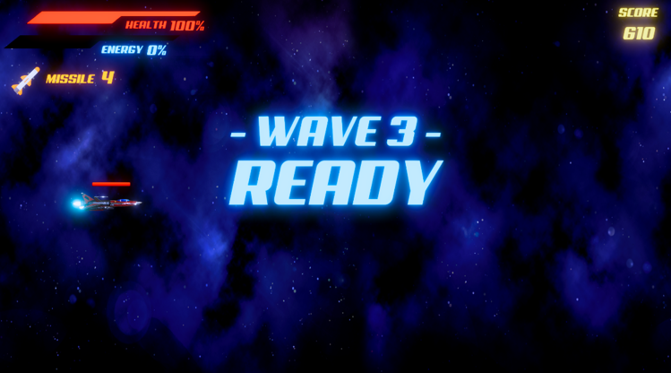

# Star Defender

## Introduction

**Title**: Star Defender

**Genre**: 2D pseudo-3D horizontal shoot 'em up

**Gameplay**: Infinite waves of enemies with a score-based leaderboard

## Gameplay

**Mode**: Endless Wave Survival Mode

**Objective**: Players fight against increasingly powerful enemies to prolong game time and accumulate as much score as possible. Scores are recorded on a leaderboard for competition and comparison.

## Wave Mechanics

- Enemy waves are spaced with a 3-second interval, displaying the number of the next wave.
- A boss fight occurs after every 10 waves of regular enemies.
- Post-boss fight, the quantity and health of generated enemies increase.

## Player Spaceship Features

- **Health Bar**: Decreases when hit, regenerates over time, and can be replenished by health items dropped by enemies.
- **Energy Bar**: Increases when shooting and defeating enemies.
- **Regular Laser Bullets**: Three modes - single-line, double-line, and triple-line, upgradable by collecting weapon upgrade items.
- **Missiles**: Can track enemies and eliminate all in a range.
- **Evade Action**: Evades bullets and collisions, consuming 25% of the energy bar.
- **Bullet Time**: Triggered by evade action or being hit, slows down time briefly.
- **Overload Mode**: Triggered at 100% energy, enhances speed, fire rate, and upgrades bullets to tracking bullets. Energy decreases until 0%, then returns to normal mode.

## Enemy Types

- **Regular Enemies**: Shoot single-line bullets, three-line scatter shots, and tracking bullets.
- **Boss**: Higher health, uses all three bullet types, a laser cannon ability with cooldown, and changes attack patterns based on player position.

## Power-Ups

- Dropped randomly by defeated enemies.
- Include score bonuses (bronze, silver, gold medals), health regeneration, weapon upgrades, and missile additions.

## Game User Interface

Includes several interfaces: Main Menu, Story Introduction, Game Controls, Game Over screen, Score Tally, and Leaderboard screen.

---

**The End**
